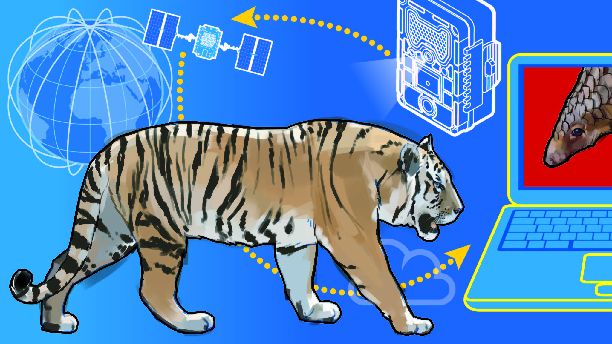

### Wild Animal Classification (WAC)

`WAC` is a GraphQL and REST built with `flask` and `ariadne` to perform image classification based on `6` wild animals which are:

```
- cheetah
- fox
- hyena
- lion
- wolf
- tiger
```

<p align="center">

<p>

Wild Animal Classification is an AI api for performing image classification task based on `6` animals that were used to train the model. Given an image of the listed wild animal the model should be able to name the animal that is in that image.

<p align="center">

<p>

### WAC Tool (mobile)

WAC tool is an AI tool for mobile application that is used to perform some basic wild animal image classification task in real-time. Given an image from a camera or an imported image the application must be able to classify the name or class of the wild animal on that picture in real-time.

<p align="center">


<p>

### API

WAC api is a simple rest api that is served at `http://localhost:3001/api/v1/classify` and is able to the name of that wild animal from an image.

### API response

If a proper `POST` request is sent to the server at `http://127.0.0.1:3001/api/v1/classify` we will be able to get `~93%` accurate predictions of the name of the wild animal on that image.

### cURL request

If a `cURL` request is send to the server at localhost which looks as follows:

```shell
cURL -X POST -F image=@cheetah.png http://127.0.0.1:3001/api/v1/classify
```

The server will respond with the `API` response which looks as follows:

```json
{
  "predictions": {
    "predictions": [
      { "className": "cheetah", "label": 0, "probability": 0.9900000095367432 },
      { "className": "fox", "label": 1, "probability": 0.0 },
      { "className": "hyena", "label": 2, "probability": 0.0 },
      { "className": "lion", "label": 3, "probability": 0.0 },
      { "className": "tiger", "label": 4, "probability": 0.009999999776482582 },
      { "className": "wolf", "label": 5, "probability": 0.0 }
    ],
    "topPrediction": {
      "className": "cheetah",
      "label": 0,
      "probability": 0.9900000095367432
    }
  },
  "success": true
}
```

### GraphQL endpoint

GraphQL endpoint is served at `http://localhost:3001/graphql` sending a graphql request at this endpoint with an image file for example as follows using `cURL`:

```shell
curl http://localhost:3001/graphql -F operations='{ "query": "mutation ClassifyWildAnimal($input: WildAnimalInput!) { classifyWildAnimal(input: $input) { error { field message } ok prediction { topPrediction {  label probability className } predictions {  label probability className } } } }", "variables": { "input": {"image": null} } }'  -F map='{ "0": ["variables.input.image"] }'  -F 0=@cheetah.png
```

Will yield the results that looks as follows:

```json
{
  "data": {
    "classifyWildAnimal": {
      "error": null,
      "ok": true,
      "prediction": {
        "predictions": [
          {
            "className": "cheetah",
            "label": 0,
            "probability": 0.9700000286102295
          },
          { "className": "fox", "label": 1, "probability": 0.0 },
          {
            "className": "hyena",
            "label": 2,
            "probability": 0.009999999776482582
          },
          { "className": "lion", "label": 3, "probability": 0.0 },
          {
            "className": "tiger",
            "label": 4,
            "probability": 0.029999999329447746
          },
          { "className": "wolf", "label": 5, "probability": 0.0 }
        ],
        "topPrediction": {
          "className": "cheetah",
          "label": 0,
          "probability": 0.9700000286102295
        }
      }
    }
  }
}
```

### Notebooks

The notebooks for training the model that is being used to perform image classification on wild animals is found [here](https://github.com/CrispenGari/cv-torch/blob/main/04_WILD_ANIMAL_CLASSIFICATION/01_WILD_ANIMAL_CLASSIFICATION.ipynb).

### License

In this simple AI tool i'm using `MIT` license which read as follows:

```shell
MIT License

Copyright (c) 2022 crispengari

Permission is hereby granted, free of charge, to any person obtaining a copy
of this software and associated documentation files (the "Software"), to deal
in the Software without restriction, including without limitation the rights
to use, copy, modify, merge, publish, distribute, sublicense, and/or sell
copies of the Software, and to permit persons to whom the Software is
furnished to do so, subject to the following conditions:

The above copyright notice and this permission notice shall be included in all
copies or substantial portions of the Software.

THE SOFTWARE IS PROVIDED "AS IS", WITHOUT WARRANTY OF ANY KIND, EXPRESS OR
IMPLIED, INCLUDING BUT NOT LIMITED TO THE WARRANTIES OF MERCHANTABILITY,
FITNESS FOR A PARTICULAR PURPOSE AND NONINFRINGEMENT. IN NO EVENT SHALL THE
AUTHORS OR COPYRIGHT HOLDERS BE LIABLE FOR ANY CLAIM, DAMAGES OR OTHER
LIABILITY, WHETHER IN AN ACTION OF CONTRACT, TORT OR OTHERWISE, ARISING FROM,
OUT OF OR IN CONNECTION WITH THE SOFTWARE OR THE USE OR OTHER DEALINGS IN THE
SOFTWARE.
```
